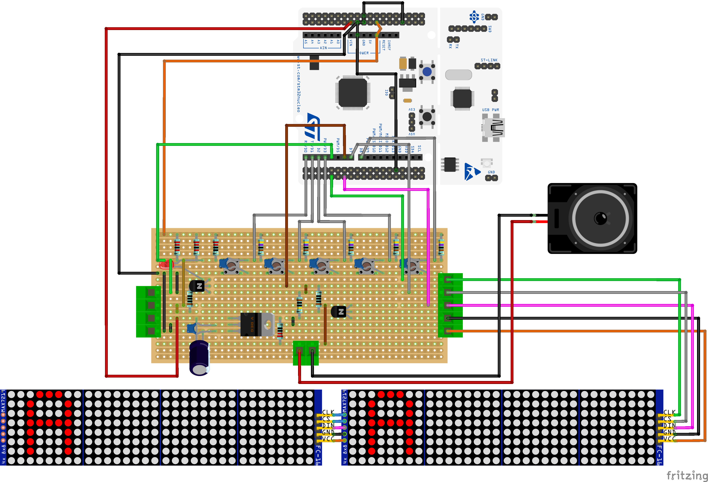

# Orienteering Start Clock synchronized to DCF77

[](LICENSE)

Equity in sport is a key point during competition. In orienteering, equity is not guaranteed — start time differs per category and per racer. The start clock has no synchronization with the finish clock (managed by the punching system). Two unsynchronized clocks will drift and introduce uncertainty in effective race time. This project solves that problem by keeping the start clock synchronized to the absolute time delivered by the DCF77 signal.

More details on the [project Wiki](https://github.com/Jolatomme/CO_Startclock/wiki).

## Features

- Synchronizes to DCF77 time signal (German longwave, 77.5 kHz)
- Falls back to internal RTC when DCF77 signal is unavailable
- Real-time display on MAX7219 LED dot matrix (64x8)
- Automatic DST (summer/winter time) handling
- Built on MicroPython for rapid prototyping

## Hardware Requirements

| Component | Description |
|---|---|
| Microcontroller | STM32 Nucleo-64 board (see [supported boards](https://github.com/Jolatomme/CO_Startclock/wiki#micro-controller-platform)) |
| DCF77 receiver | Standard DCF77 module with antenna (e.g., DCF77-1, Hama, etc.) |
| Display | MAX7219-based 8x8 LED dot matrix, 8 modules chained (64x8) |
| Power | USB or external 5V supply |

## Pin Connections

| Nucleo Pin | Connection |
|---|---|
| D4 | DCF77 receiver TCO (time signal output) |
| D7 | MAX7219 CS (chip select) |
| SPI2 SCK | MAX7219 CLK |
| SPI2 MOSI | MAX7219 DIN |
| 3.3V / 5V | DCF77 receiver VCC |
| GND | Common ground |

## Getting Started

### 1. Install MicroPython

Download the latest MicroPython firmware for your board from [micropython.org](https://micropython.org/download/) and flash it using the STM32 Cube Programmer or DFU mode.

### 2. Upload the firmware

```bash
# Using ampy
ampy --port COM3 put boot.py
ampy --port COM3 put main.py
ampy --port COM3 put dcf77.py
ampy --port COM3 put max7219.py

# Or using rshell
rshell -p COM3 cp *.py /pyboard/
```

### 3. Wire the components

Refer to the [Fritzing layout](Fritzing/CO_Clock.fzz) or the [KiCad schematics](StartClock/StartClock.kicad_sch) for detailed wiring.

### 4. Power on

The clock will synchronize with DCF77 and display the current time. The onboard LED blinks once per second and stays on during the last 10 seconds of each minute.

## Project Structure

```
├── nucleo_flash/          # MicroPython firmware
│   ├── boot.py            # Boot configuration
│   ├── main.py            # Main application (async RTC + display)
│   ├── dcf77.py           # DCF77 signal decoder
│   ├── max7219.py         # MAX7219 LED matrix driver
│   └── ds18x20.py         # DS18X20 temperature sensor driver
├── StartClock/            # KiCad hardware design
│   ├── StartClock.kicad_sch   # Schematic
│   ├── StartClock.kicad_pcb   # PCB layout
│   └── StartClock.kicad_pro   # Project file
├── Fritzing/              # Breadboard layout
│   └── CO_Clock.fzz
├── Img/                   # Images
├── README.md
└── LICENSE                # MIT
```

## Project example on a single-sided stripboard



## License

This project is licensed under the [MIT License](LICENSE).
